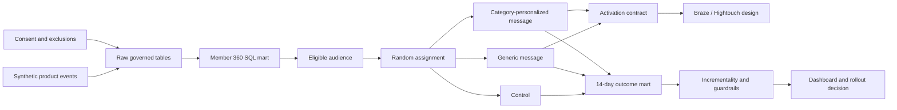

# Marketplace Seller Reactivation & Listing Growth

An end-to-end marketing automation analytics reference implementation for a two-sided marketplace. The
project turns product events and consent history into a governed activation audience, runs a
three-arm randomized experiment, measures incremental listing creation, checks customer guardrails,
and produces a staged rollout decision.

All data is deterministic and synthetic. No real customer, employee, campaign or financial data is
used.

## Executive result

At seed `42`, the pipeline generates 12,000 members and 95,000+ product events. After applying
lifecycle, consent, suppression, contact-pressure and campaign-conflict rules, 4,051 eligible lapsed
sellers are randomized as evenly as possible across control, generic and personalized experiences.

The personalized treatment produces:

- 11.33% 14-day listing conversion versus 7.92% in control;
- 3.41 percentage points absolute uplift and 43.1% relative uplift;
- a positive 95% confidence interval after a pre-specified two-arm comparison;
- an unsubscribe rate of 0.22%, below the 1% customer guardrail;
- an estimated 46 incremental listings in the test population.

The decision is a staged 50% rollout, not a full launch, with a persistent 10% holdout and continued
monitoring of unsubscribe, listing quality and downstream sales.

Open the generated [campaign dashboard](reports/dashboard.html) or read the
[executive summary](reports/executive_summary.md).

## Business question

> Among historical sellers who have not listed for at least 90 days but remain recently active, does
> a category-personalized reactivation message increase 14-day listing creation versus no message,
> without increasing unsubscribe or over-contacting members?

This framing intentionally separates:

- the **eligibility policy**: who may safely enter the campaign;
- the **experiment policy**: how causal impact will be measured;
- the **activation policy**: which channel and content each treatment receives;
- the **decision policy**: the evidence required before rollout.

## What this project demonstrates

- Lifecycle segmentation using reusable SQL marts
- Event and identity quality checks
- Consent, suppression and frequency-cap governance
- Randomized control design and intention-to-treat analysis
- Sample-ratio-mismatch and pre-treatment balance checks
- Multiple-comparison control and score-based confidence intervals
- Incremental conversion, customer guardrails and scenario ROI
- A warehouse-to-activation contract suitable for Hightouch and Braze
- A dbt/Snowflake migration path with model and singular tests

## Architecture



The default executable path uses Python's standard library and SQLite so the project can be reproduced
without credentials or paid services. The [`dbt/`](dbt/) directory shows the Snowflake
implementation boundary; it is deliberately labelled as a migration scaffold rather than presented
as a production deployment.

## Run the project

Requirements: Python 3.11 or later. No third-party package is required for the local case.

```bash
python3 run_project.py
python3 -m unittest discover -s tests -v
```

The first command performs five steps:

1. Generate synthetic members, events, listings, consent history and campaign touches.
2. Load raw CSVs and build the SQL analytics marts.
3. Run integrity, privacy and campaign-safety checks.
4. Analyse randomization, incrementality, guardrails and scenario economics.
5. Produce a static campaign dashboard and executive summary.

Useful options:

```bash
python3 run_project.py --members 12000 --seed 42
python3 run_project.py --skip-generate
```

## Repository guide

| Path | Purpose |
|---|---|
| `src/generate_data.py` | Deterministic privacy-safe marketplace simulation |
| `src/pipeline.py` | Raw ingestion and ordered SQL model execution |
| `sql/` | Member 360, governed audience and experiment outcome marts |
| `src/quality_checks.py` | Automated integrity, consent and campaign-safety assertions |
| `src/analyze_experiment.py` | Randomization checks, causal comparison and decision policy |
| `src/build_dashboard.py` | Dependency-free static campaign dashboard |
| `docs/tracking_plan.csv` | Governed product-event contract |
| `docs/campaign_canvas.md` | Braze-style journey, entry/exit and suppression design |
| `docs/activation_contract.md` | Warehouse audience fields and destination expectations |
| `dbt/` | Snowflake-oriented dbt migration scaffold and tests |
| `tests/` | Regression tests for generation, safety rules and analysis |
| `reports/` | Generated dashboard, metrics, quality report and executive summary |

## Experiment decision policy

The primary outcome is binary 14-day listing creation. Opens and clicks are diagnostic only.

A treatment can progress only when all conditions hold:

1. Sample-ratio-mismatch p-value is at least 0.01.
2. Maximum absolute pre-treatment standardized mean difference is below 0.10.
3. Bonferroni-adjusted treatment p-value is below 0.05.
4. The 95% confidence interval for absolute uplift is entirely above zero.
5. Unsubscribe remains at or below 1%.
6. Scenario ROI is positive using an explicitly documented unit-value assumption.

The commercial model is illustrative and deliberately separated from the causal result. In a real
company, Finance-approved contribution margin and long-term downstream value would replace the
synthetic NZ$5.50 value per incremental listing.

## Privacy and campaign safety

The audience contains pseudonymous member IDs, never email addresses or message content. Eligibility
requires channel consent at campaign time, no suppression, fewer than two marketing contacts in the
prior seven days, and no conflicting high-priority journey or holdout. Control members receive no
campaign message.

See [compliance checklist](docs/compliance_checklist.md) and
[campaign runbook](docs/operations_runbook.md) for release, rollback and unsubscribe procedures.

## Limitations and next production steps

- Synthetic treatment effects validate the workflow, not a real business outcome.
- Identity resolution is simplified to a governed anonymous-to-member mapping.
- The local warehouse is SQLite; production should use Snowflake roles, schemas, resource monitors,
  incremental dbt models and orchestrated freshness alerts.
- Braze and Hightouch are represented through contracts and journey design because no production
  workspace or credentials are used.
- The 14-day outcome should be extended to downstream sale quality, repeat behaviour and durable
  incrementality before a permanent 100% rollout.
