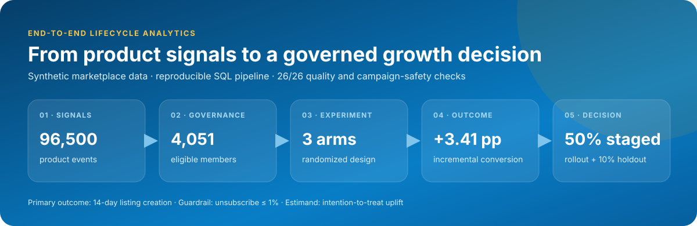
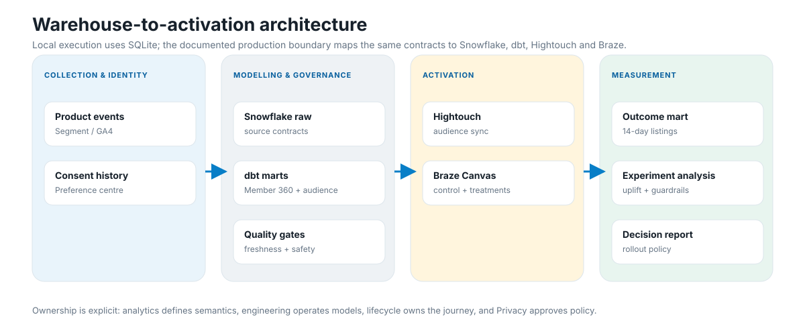
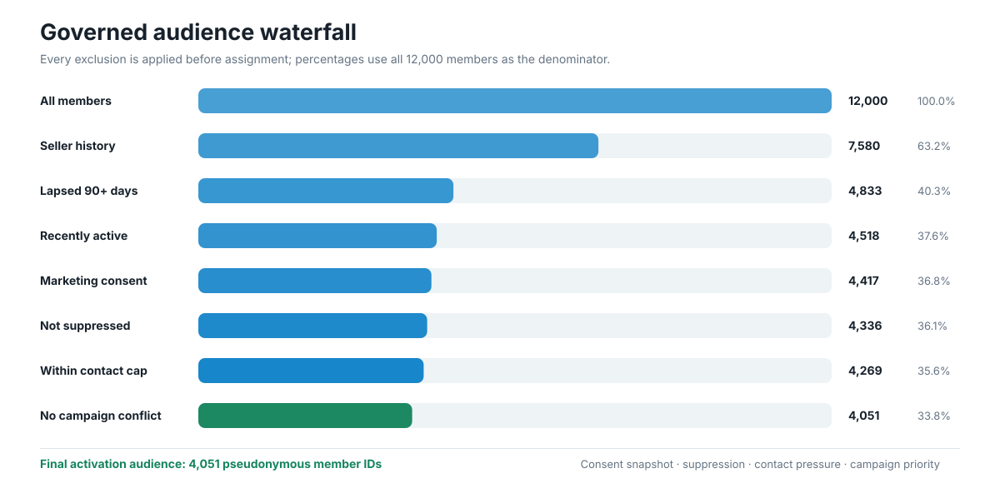
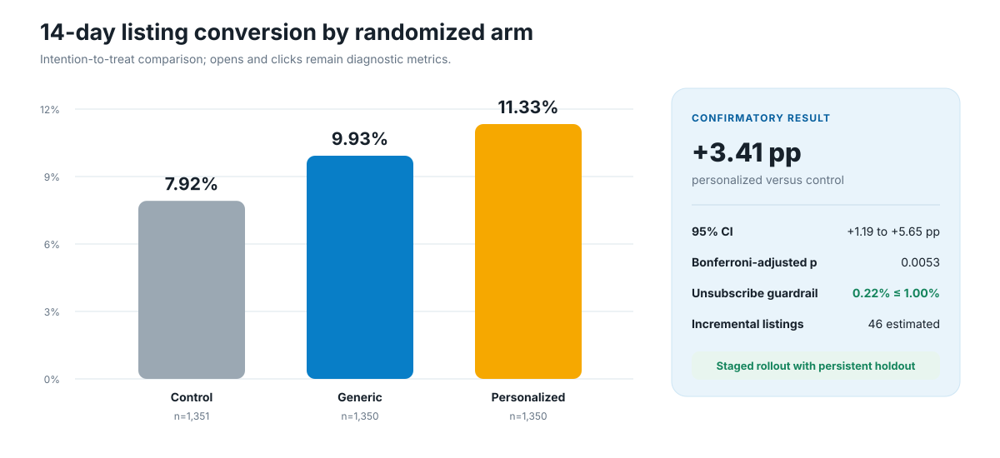
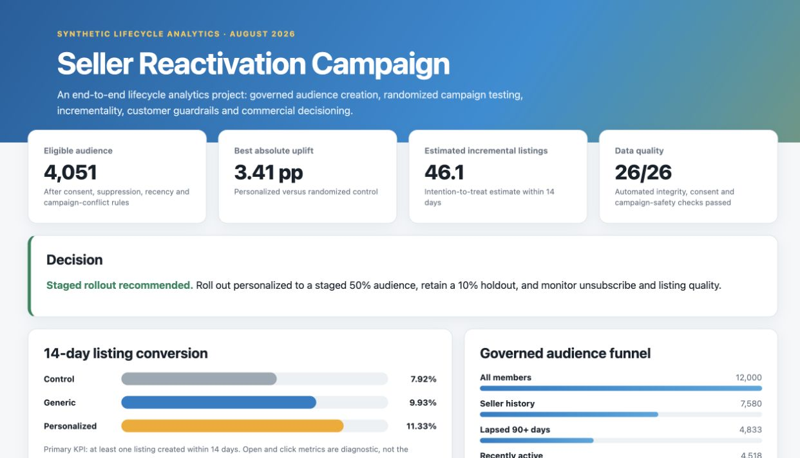

# Marketplace Seller Reactivation & Listing Growth

An end-to-end lifecycle marketing analytics reference implementation for a two-sided marketplace.
The project converts product behaviour, listing history, consent and campaign-pressure data into a
governed activation audience; evaluates two treatments through a randomized controlled experiment;
and produces a decision-ready dashboard, operational controls and a production migration path.

All member, event, campaign and financial data in this repository is deterministic and synthetic.

<p align="center">
  
</p>

## Project at a glance

| Area | Design |
|---|---|
| Business objective | Reactivate lapsed sellers and increase marketplace listing supply |
| Target population | Historical sellers inactive for 90+ days but active on the product in the past 30 days |
| Primary outcome | Member creates at least one listing within 14 days of assignment |
| Experiment | Randomized control, generic message and category-personalized message |
| Customer guardrail | Treatment unsubscribe rate must remain at or below 1% |
| Governance | Effective-dated consent, suppression, contact cap and campaign-priority exclusions |
| Best observed result | Personalized: 11.33% conversion versus 7.92% control |
| Decision | Stage personalized to 50%, retain a 10% persistent holdout and monitor listing quality |

## Contents

1. [Business problem and success criteria](#1-business-problem-and-success-criteria)
2. [End-to-end solution](#2-end-to-end-solution)
3. [Data foundation and analytical models](#3-data-foundation-and-analytical-models)
4. [Governed audience design](#4-governed-audience-design)
5. [Campaign and experiment design](#5-campaign-and-experiment-design)
6. [Measurement methodology](#6-measurement-methodology)
7. [Results and rollout decision](#7-results-and-rollout-decision)
8. [Dashboard and reporting outputs](#8-dashboard-and-reporting-outputs)
9. [Data quality, privacy and campaign safety](#9-data-quality-privacy-and-campaign-safety)
10. [Repository structure](#10-repository-structure)
11. [Reproduce the project](#11-reproduce-the-project)
12. [Production migration path](#12-production-migration-path)
13. [Assumptions and limitations](#13-assumptions-and-limitations)

## 1. Business problem and success criteria

A two-sided marketplace needs a healthy supply of relevant listings as well as buyer demand.
Historical sellers who still browse, watch or purchase are a promising reactivation population, but
broad messaging creates three risks:

- naturally returning sellers may be incorrectly counted as campaign-driven conversions;
- members may be contacted without current channel consent or while another journey is active;
- message performance may be optimized to clicks instead of incremental listing supply.

The project therefore answers one causal business question:

> Among historical sellers who have not listed for at least 90 days but remain recently active,
> does a category-personalized reactivation message increase 14-day listing creation versus no
> message, without increasing unsubscribe or over-contacting members?

Success requires more than a positive point estimate. A treatment progresses only when assignment is
valid, the adjusted statistical result is positive, the confidence interval excludes zero, customer
guardrails pass and the commercial scenario remains positive.

## 2. End-to-end solution

<p align="center">
  
</p>

The executable local path uses Python's standard library and SQLite, allowing the complete workflow
to run without paid services or credentials. The production boundary preserves the same contracts
while mapping them to Snowflake, dbt, Hightouch, Braze and a BI reporting layer.

| Stage | Local implementation | Production-oriented boundary |
|---|---|---|
| Collection | Deterministic CSV event simulation | Segment/GA4 events and governed source tables |
| Warehouse | SQLite raw tables and SQL marts | Snowflake roles, schemas and resource monitors |
| Transformation | Ordered SQL files | dbt staging, intermediate and mart models |
| Activation | Pseudonymous audience contract | Hightouch sync into Braze Canvas |
| Experiment | Pre-campaign deterministic assignment | Immutable assignment and exposure records |
| Reporting | Static HTML, JSON, Markdown and SVG | BI dashboard, alerts and scheduled decision reporting |

The data flow is deliberately ordered:

1. Generate privacy-safe marketplace entities and product events.
2. Load raw tables and validate keys, identities, timestamps and governed values.
3. Build a pre-treatment member 360 mart.
4. Apply lifecycle, permission and campaign-safety rules.
5. Randomize the eligible audience before campaign exposure.
6. Join 14-day outcomes and estimate intention-to-treat incrementality.
7. Publish decision metrics, quality evidence and activation-ready outputs.

Detailed ownership and system boundaries are documented in
[architecture and ownership](docs/architecture.md).

## 3. Data foundation and analytical models

### Raw entities

| Entity | Grain | Analytical purpose |
|---|---|---|
| Members | One row per member at campaign time | Lifecycle attributes and consent snapshot |
| Events | One row per product event | Recent activity and category-intent signals |
| Listings | One row per listing | Seller history, lapsed status and experiment outcome |
| Consent history | One effective-dated consent change | Channel permission at campaign time |
| Campaign touches | One attempted campaign touch | Contact pressure, exposure and response diagnostics |
| Campaign exclusions | One exclusion interval | Priority journeys, support holds and holdouts |
| Experiment assignments | One assignment per eligible member | Immutable experiment arm and assignment time |

### Analytical marts

| Model | Grain | Responsibility |
|---|---|---|
| `mart_member_360` | One row per member | Pre-treatment lifecycle features and rule flags |
| `mart_campaign_eligible_audience` | One row per eligible member | Activation-safe pseudonymous audience |
| `mart_experiment_member_outcomes` | One row per assigned member | Exposure, listing outcome and guardrail measures |
| `mart_experiment_results` | One row per arm | Reconciled counts and reporting metrics |

Only pre-campaign records are used for eligibility, personalization and balance diagnostics.
Post-assignment records enter the outcome model only, preventing treatment leakage into audience
construction.

See the full [data dictionary](docs/data_dictionary.md) and governed
[tracking plan](docs/tracking_plan.csv).

## 4. Governed audience design

<p align="center">
  
</p>

The 12,000-member population becomes a 4,051-member activation audience after applying the rules in
a fixed order. Each rule has a customer, legal or measurement rationale.

| Rule | Implementation | Why it exists |
|---|---|---|
| Seller history | At least one listing before campaign launch | Restricts the journey to genuine seller reactivation |
| Lapsed status | No listing during the previous 90 days | Separates reactivation from active-seller engagement |
| Recent activity | At least one product event in 30 days | Adds a current relevance signal |
| Channel consent | Effective consent for email or push | Prevents unpermissioned activation |
| Suppression | Global and channel suppression must be false | Enforces unsubscribe and safety policy |
| Contact cap | Fewer than two marketing contacts in seven days | Limits fatigue and cross-journey pressure |
| Campaign priority | No high-priority journey, support hold or experiment holdout | Prevents conflicts and contamination |

The activation export contains pseudonymous member IDs and only the fields required to route the
message. It excludes email addresses, message content and historical GMV. The destination contract is
defined in [warehouse-to-activation contract](docs/activation_contract.md).

## 5. Campaign and experiment design

The eligible audience is assigned as evenly as possible across three arms before campaign launch.

| Arm | Members | Experience | Measurement role |
|---|---:|---|---|
| Control | 1,351 | No target-campaign message | Estimates organic 14-day listing conversion |
| Generic | 1,350 | Standard seller-reactivation message | Tests whether a basic reminder creates lift |
| Personalized | 1,350 | Message using the latest governed category signal | Tests whether relevance increases lift |

The campaign design maintains strict separation between four policies:

- **Eligibility policy:** who is permitted and relevant to enter.
- **Assignment policy:** how eligible members receive an experiment arm.
- **Activation policy:** which channel and message each treatment receives.
- **Decision policy:** what evidence is required before rollout.

Control members receive no target-campaign touch during the outcome window. Treatment members receive
one initial touch, exit immediately on listing creation, unsubscribe or suppression, and receive no
automatic second touch in the initial design.

The full journey, entry rules and exits are documented in
[campaign canvas](docs/campaign_canvas.md).

## 6. Measurement methodology

### Primary estimand

The primary estimand is the intention-to-treat difference in the probability of creating at least one
listing within 14 days. Click and open rates remain diagnostic because they do not establish
incremental seller supply.

### Statistical policy

- two-sided pooled two-proportion z-test for each treatment-control comparison;
- Newcombe 95% score interval for absolute difference in proportions;
- Bonferroni correction across the two pre-specified treatment comparisons;
- fixed sample analysis with no result-driven early stop;
- sample-ratio-mismatch test before reading treatment effects;
- pre-treatment standardized mean differences across seven covariates;
- 80% power for a four-percentage-point minimum detectable effect.

The power plan requires 972 members per arm. The experiment contains at least 1,350 per arm.

### Decision gates

| Gate | Required | Observed | Status |
|---|---:|---:|---|
| Sample-ratio-mismatch p-value | ≥ 0.01 | 0.9998 | Pass |
| Maximum absolute pre-treatment SMD | < 0.10 | 0.047 | Pass |
| Personalized adjusted p-value | < 0.05 | 0.0053 | Pass |
| Personalized uplift 95% CI | Entirely above 0 | +1.19 to +5.65 pp | Pass |
| Personalized unsubscribe | ≤ 1.00% | 0.22% | Pass |
| Scenario ROI | > 0% | 72.4% | Pass |

The methodology and avoided analytical errors are specified before result interpretation in the
[pre-analysis plan](docs/experiment_plan.md).

## 7. Results and rollout decision

The personalized treatment increases 14-day listing conversion by 3.41 percentage points versus
control, a 43.1% relative uplift.

<p align="center">
  
</p>

| Metric | Control | Generic | Personalized |
|---|---:|---:|---:|
| Assigned members | 1,351 | 1,350 | 1,350 |
| 14-day converters | 107 | 134 | 153 |
| 14-day listing conversion | 7.92% | 9.93% | 11.33% |
| Absolute uplift vs control | — | +2.01 pp | +3.41 pp |
| 95% CI for uplift | — | -0.15 to +4.17 pp | +1.19 to +5.65 pp |
| Bonferroni-adjusted p-value | — | 0.1350 | 0.0053 |
| Unsubscribe rate | — | 0.74% | 0.22% |
| Estimated incremental listings | — | 27 | 46 |
| Scenario ROI | — | 48.6% | 72.4% |

The generic treatment has a positive point estimate but does not pass the adjusted significance and
confidence-interval gates. The personalized treatment passes all randomization, statistical,
customer and commercial gates.

The decision is therefore a **staged 50% personalized rollout**, not an immediate full launch.
A persistent 10% holdout preserves a longer-term counterfactual while unsubscribe, support contact,
listing quality, downstream sales and repeat behaviour are monitored.

## 8. Dashboard and reporting outputs

<p align="center">
  
</p>

Run the pipeline and open [the generated campaign dashboard](reports/dashboard.html) in a browser for
the complete audience funnel, experiment table, category distribution, randomization diagnostics and
decision summary.

| Output | Format | Use |
|---|---|---|
| [Campaign dashboard](reports/dashboard.html) | HTML | Visual review of audience, experiment and rollout evidence |
| [Executive summary](reports/executive_summary.md) | Markdown | Concise decision, evidence and next actions |
| [Experiment metrics](reports/experiment_metrics.json) | JSON | Machine-readable statistical and commercial results |
| [Data quality report](reports/data_quality.json) | JSON | Evidence for all integrity and campaign-safety checks |
| [Activation sample](reports/activation_audience_sample.csv) | CSV | Pseudonymous destination-contract example |

The SVG charts embedded in this README are generated from the same current metrics and warehouse
tables as the dashboard, so they remain consistent when the project is rerun.

## 9. Data quality, privacy and campaign safety

The executable pipeline runs 26 blocking checks before analysis and reporting.

| Control area | Examples |
|---|---|
| Identity and keys | Unique member, event and listing IDs; one member per anonymous identity |
| Referential integrity | Events, listings and touches resolve to known members |
| Temporal integrity | Events follow member creation; sales follow listing creation |
| Consent governance | Effective-dated status values and campaign-date snapshot reconciliation |
| Audience safety | Current channel consent, no suppression, contact cap and no journey conflict |
| Experiment integrity | Complete unique assignment, valid variants and assignment before exposure |
| Exposure integrity | Zero control contamination and one planned treatment touch |
| Reconciliation | Eligible audience, assignments, exposures and result population agree |

The project deliberately excludes real customer data, email addresses, message bodies and production
credentials. Privacy and release responsibilities that cannot be automated remain explicit human
approval gates.

See the [compliance checklist](docs/compliance_checklist.md) and
[campaign operations runbook](docs/operations_runbook.md).

## 10. Repository structure

```text
marketplace-lifecycle-automation/
├── run_project.py                 # End-to-end orchestration
├── src/
│   ├── generate_data.py           # Deterministic synthetic marketplace data
│   ├── pipeline.py                # Raw ingestion and SQL model execution
│   ├── quality_checks.py          # Blocking integrity and campaign-safety checks
│   ├── analyze_experiment.py      # Causal comparison and decision policy
│   ├── build_dashboard.py         # Static HTML dashboard
│   └── build_readme_assets.py     # Data-driven SVG documentation visuals
├── sql/                           # Local member, audience and outcome marts
├── dbt/                           # Snowflake-oriented migration scaffold and tests
├── docs/                          # Design, governance, tracking and runbook documents
│   └── assets/                    # Generated README visuals and dashboard preview
├── reports/                       # Generated decision and quality artifacts
└── tests/                         # End-to-end regression tests
```

## 11. Reproduce the project

Requirements: Python 3.11 or later. The local execution path requires no third-party packages.

```bash
python3 run_project.py
python3 -m unittest discover -s tests -v
```

The first command:

1. generates 12,000 synthetic members and 96,500 product events with seed `42`;
2. builds the SQLite warehouse and analytics marts;
3. executes all data-quality and campaign-safety gates;
4. analyzes randomization, incrementality, guardrails and scenario economics;
5. rebuilds the dashboard, executive summary and README visual assets.

Useful options:

```bash
python3 run_project.py --members 12000 --seed 42
python3 run_project.py --skip-generate
```

Expected validation result:

```text
26/26 data and campaign-safety checks passed
11/11 regression tests passed
```

The GitHub workflow runs the complete build and test sequence on every push and pull request.

## 12. Production migration path

The local project demonstrates semantics and control flow; production operation requires additional
platform and ownership controls.

- load governed event, identity, consent and campaign data into Snowflake raw schemas;
- convert high-volume dbt models to incremental materializations with freshness alerts;
- isolate development and CI through least-privilege roles and cloned schemas;
- sync only activation-contract fields through Hightouch;
- re-check consent, suppression and contact pressure immediately before Braze entry;
- preserve immutable assignment, exposure and model-version records;
- reconcile warehouse, destination and delivered-message counts;
- route test failures to campaign release and incident-management procedures;
- replace synthetic unit economics with Finance-approved contribution margins;
- extend measurement to listing quality, sale conversion and durable seller retention.

The [dbt migration scaffold](dbt/) contains staging, intermediate and mart models plus singular safety
tests for suppression, contact caps and control contamination.

## 13. Assumptions and limitations

- Treatment effects are simulated to validate the workflow; they are not evidence of a real campaign
  outcome.
- Identity resolution is simplified to a governed anonymous-to-member mapping.
- The commercial scenario uses a synthetic NZ$5.50 value per incremental listing and illustrative
  campaign costs.
- The 14-day window does not establish long-term listing quality, repeat behaviour or seller value.
- Braze and Hightouch are represented through contracts and journey design because no production
  workspace or credentials are used.
- Legal purpose, campaign copy, brand suitability and broader privacy risk still require qualified
  human review.
