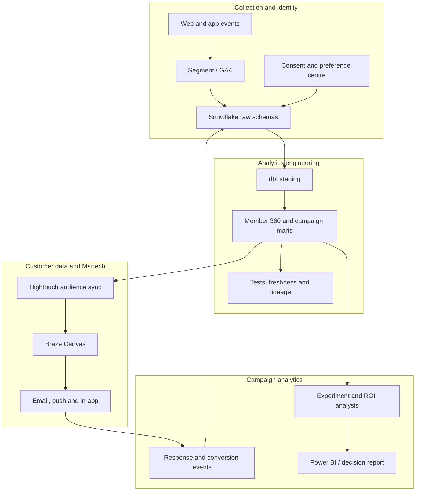

# Architecture and ownership

## Logical production flow

## Ownership boundaries

- The analyst owns the semantic definition of eligibility and outcomes.
- Analytics engineering owns reliable transformation and deployment patterns.
- Lifecycle owns the journey and member experience.
- Platform teams own source collection and destination availability.
- Legal and Privacy approve policy; automated tests enforce only the encoded portion of that policy.

The project keeps these boundaries explicit so a successful notebook cannot silently become an
unsafe production audience.

