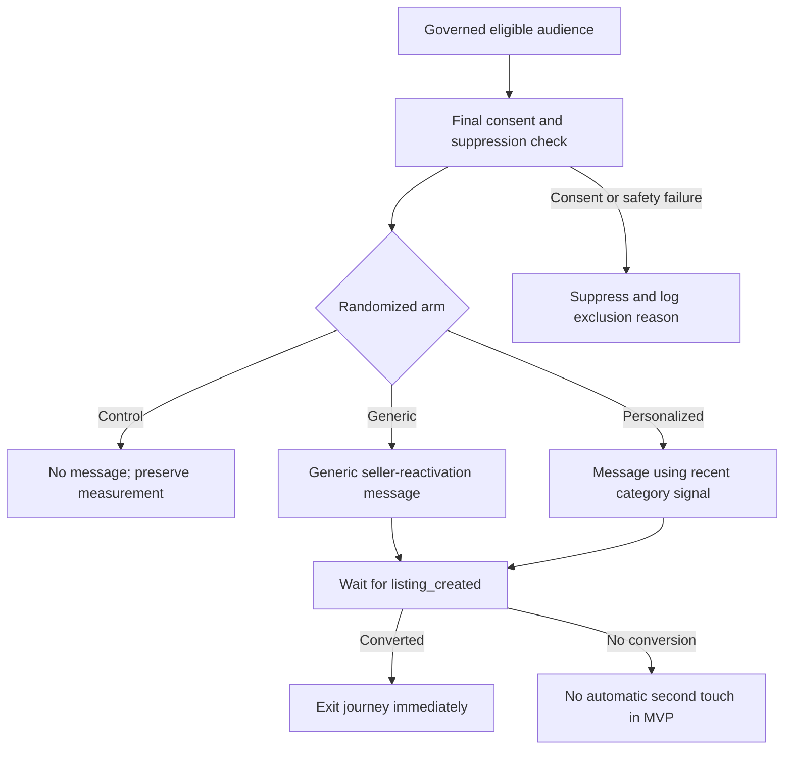

# Braze-style campaign canvas

## Entry

Audience is refreshed immediately before assignment from `mart_campaign_eligible_audience`.
Entry is blocked if the member loses consent, enters suppression, reaches the contact cap or joins a
higher-priority journey between audience creation and send time.

## Journey

## Channel rule

Use the member's preferred channel only if that channel has consent. Otherwise use the other
consented channel. If neither remains consented, suppress the member.

## Personalization

- Category comes from the latest valid pre-campaign event with a governed category value.
- Missing category falls back to generic content; it does not block the campaign.
- No sensitive or inferred personal attribute is used.

## Exit and conversion

- Conversion event: `listing_created`
- Conversion window: 14 days
- Exit immediately on conversion, unsubscribe, suppression or customer-support hold
- Control remains untouched by this campaign throughout the outcome window

## Frequency and priority

- Fewer than two marketing messages in the preceding seven days at entry
- Re-check contact pressure at send time
- Customer-support and safety communications outrank marketing
- Other experiments may not reuse control members during the measurement window

